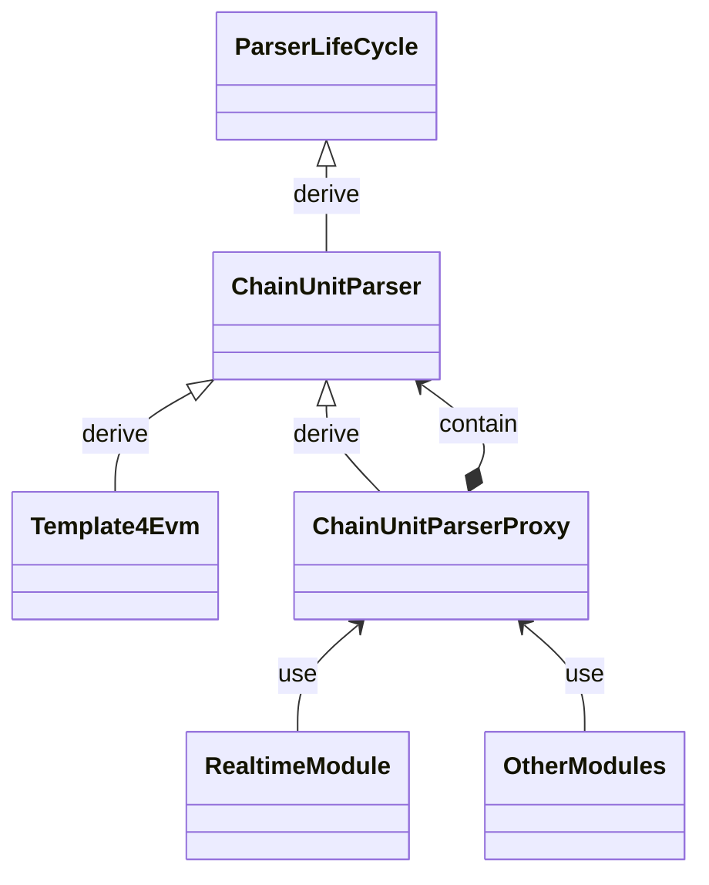
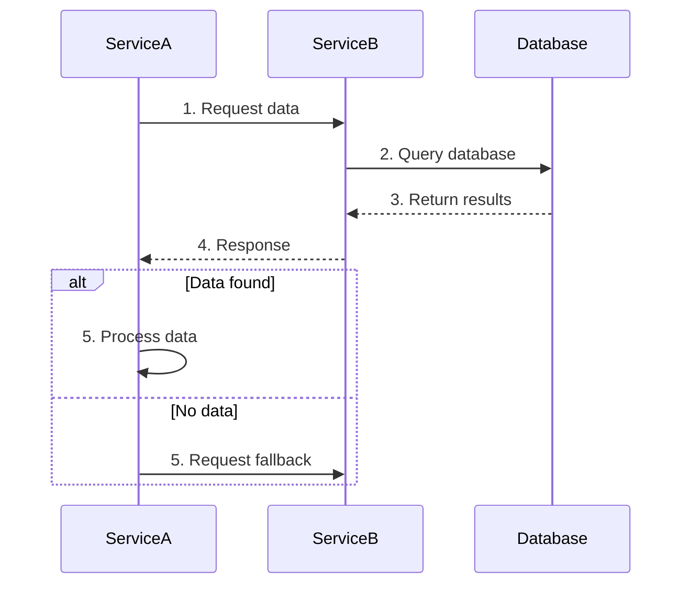

# Lark Technical Document Writer

Write technical documents and architecture/UML diagrams following team documentation standards, optimized for publishing on Lark Docs/Wiki.

## When to Use This Skill

- Writing a new technical design document
- Creating architecture diagram descriptions or specifications
- Drafting UML diagrams (class, sequence, state) in Mermaid or PlantUML
- Preparing technical proposals, post-mortems, or system overviews for Lark
- Reviewing or improving existing technical documents for standards compliance

## Technical Document Template

Every technical document MUST follow this structure:

```markdown
# Document Title

# 1. Glossary (Terminology and Definitions)
Define all domain-specific terms, acronyms, and jargon upfront.
These can be referenced directly in later sections to keep the document concise.

# 2. Background
Why does this document exist? What context does the reader need?

# 3. Problem
What specific problem are we solving? Be precise and measurable.

# 4. Solution
The proposed approach, architecture, and implementation details.
```

## Document Formatting Rules

1. **Video links at top**: If the document accompanies a presentation or recorded walkthrough, place the video link at the very top of the document.

2. **Numbered paragraphs and tables**: Use Arabic numerals (1, 2, 3...) for paragraphs, list items, and table rows. This enables quick location during remote discussions (e.g., "look at item 3 in section 2").

3. **Key conclusions at the top**: Important conclusions, decisions, and takeaways must appear near the top of the document. Highlight them using:
   - **Bold text**
   - Color highlighting
   - Lark callout blocks

4. **Write for scanability**: Readers should be able to grasp the core message by reading headings, callouts, and the first sentence of each section.

## Architecture Diagram Standards

Architecture diagrams show system structure, component relationships, and interaction patterns. They do NOT express low-level code logic (use UML for that).

### Architecture Diagram Components

- **Components**: Major system parts (services, modules, databases, API gateways)
- **Relationships**: Calls, data flows, dependencies between components
- **Workflow**: The path a request takes from entry to final processing

### Common Architecture Diagram Types

| # | Type | Purpose |
|---|------|---------|
| 1 | Logical Architecture | Functional module division and responsibilities, no tech details |
| 2 | Physical Architecture | Server/container deployment structure, nodes, networking, load balancing |
| 3 | Service Architecture | Inter-service relationships and communication (REST, gRPC, etc.) |
| 4 | Data Architecture | Databases, caches, data flow structures |
| 5 | Flow Architecture | User request path from entry to exit, tied to specific business logic |

### The 5 Elements of a Good Architecture Diagram

Every architecture diagram must incorporate these 5 elements:

#### 1. Components
- Show all major system components
- Group components logically (frontend, backend, storage layer) using boundary boxes or color
- Label physical service entities (one process = one service)
- Use meaningful shapes:
  - **Rectangle**: Services/processes (label with service name)
  - **Cylinder**: Databases (label with type: MySQL, Redis, etc.)
  - **Dashed rectangle**: External systems

#### 2. Lines
- Connect all collaborating components with lines
- Use different line styles for different interaction types:
  - **Solid line**: Synchronous calls
  - **Dashed line**: Asynchronous messages
  - **Arrow direction**: Shows data flow direction

#### 3. Arrows
- Arrows indicate data flow direction
- Arrow start = request initiator, arrow end = receiver
- Make direction clear so readers can quickly trace interaction paths

#### 4. Colors
Use colors meaningfully and consistently:

**For lines** (by communication protocol):
- Different colors for HTTP, gRPC, MQ, etc.
- Always include a legend explaining color meanings

**For components** (by status or ownership):
- Green: Running normally / core business
- Yellow: Potential risk / grayscale testing
- Red: Service anomaly / needs attention
- Blue: External systems / third-party dependencies
- Gray: Offline / pending / non-critical modules

**Or by team ownership:**
- Light blue: Frontend team
- Green: Backend team
- Orange: DevOps/infrastructure
- Gray: External systems

#### 5. Numbers
- Add numbered labels (1, 2, 3...) to key steps in the workflow
- Include a side legend explaining what each number represents
- This clarifies execution order, especially for multi-step cross-service flows

### Layout Best Practices
- Keep layouts compact and readable; avoid excessive whitespace
- Use alignment and grouping tools for orderly arrangement
- Arrange components top-to-bottom, left-to-right following call direction
- Compress diagram bounds so the structure fits within the viewable area

## UML Diagram Standards

UML diagrams express low-level code logic and system behavior. Use Mermaid syntax (compatible with both Lark and Cursor).

### Class Diagrams

Used for object-oriented modeling: classes, interfaces, and their relationships.

**When to use:**
- Designing module structure
- Clarifying class relationships during refactoring
- Documenting core models in technical docs

**Three common relationships:**
- **Inheritance** (`<|--`): "derives from"
- **Composition** (`<--*`): "contains" (strong ownership)
- **Reference/Usage** (`<--`): "uses"

**Example (Mermaid):**


### Sequence Diagrams

Show time-ordered interactions between objects/services.

**When to use:**
- Documenting API call flows (login, order placement, etc.)
- Microservice call chain tracing
- Clarifying responsibility splits between product/backend/frontend

**Example (Mermaid):**


**Key conventions:**
- Use `participant` with descriptive aliases
- Number all steps for easy reference
- Use `alt`/`par` blocks for conditional/concurrent flows
- Solid arrows (`->>`) for requests, dashed arrows (`-->>`) for responses

### State Diagrams

Show the lifecycle states of an object and transitions between them. Reference: [Visual Paradigm State Machine Guide](https://www.visual-paradigm.com/guide/uml-unified-modeling-language/what-is-state-machine-diagram/)

## Workflow: Writing a Technical Document

When the user asks to write a technical document:

1. **Clarify scope**: Ask what the document covers (design proposal, architecture overview, post-mortem, etc.)

2. **Draft the structure** using the 4-section template:
   - Glossary
   - Background
   - Problem
   - Solution

3. **Write content** following formatting rules:
   - Number all items
   - Bold/highlight key conclusions
   - Place important takeaways near the top

4. **Generate diagrams** where applicable:
   - Architecture diagrams: describe using the 5-element framework
   - UML diagrams: write in Mermaid syntax
   - Always include legends for colors and numbered steps

5. **Review checklist** before finalizing:
   - [ ] Follows the 4-section template (Glossary, Background, Problem, Solution)
   - [ ] Video link at top (if applicable)
   - [ ] All paragraphs and tables use Arabic numerals
   - [ ] Key conclusions are highlighted and near the top
   - [ ] Architecture diagrams have all 5 elements (components, lines, arrows, colors, numbers)
   - [ ] UML diagrams use Mermaid syntax
   - [ ] Compact layout with no excessive whitespace in diagrams
   - [ ] All terminology defined in the Glossary section

## Publishing to Lark

When the user wants to publish the document to Lark, use the Lark MCP `importDocument` tool:
- Format: `markdown`
- Target type: `docx` (new-style Lark document)
- Optionally specify a `folderToken` for the target location

## Examples

### Example: User asks "Help me write a design doc for a new caching layer"

1. Ask clarifying questions: What system? What cache backend? What invalidation strategy?
2. Generate the document:

```markdown
# Caching Layer Design Document

# 1. Glossary
- **Cache Hit Rate**: Percentage of requests served from cache vs. origin
- **TTL**: Time-to-live; duration before a cache entry expires
- **Write-through**: Cache update strategy where writes go to both cache and DB

# 2. Background
The current API serves all requests directly from the database, resulting in
P99 latency of 800ms under peak load. Historical data shows 70% of requests
are for the same 1000 hot keys.

# 3. Problem
1. High database load during peak hours causes latency spikes
2. Repeated queries for identical data waste compute resources
3. No caching layer exists between the API and database

# 4. Solution
## 4.1 Architecture Overview
[Architecture diagram description following 5-element framework]

## 4.2 Cache Strategy
1. **Read path**: Check Redis first, fallback to DB on miss, populate cache
2. **Write path**: Write-through to both Redis and DB
3. **Invalidation**: TTL-based (5 min) + event-driven invalidation on writes

## 4.3 Component Design
[Class diagram in Mermaid showing cache interfaces and implementations]

## 4.4 Request Flow
[Sequence diagram in Mermaid showing the read/write paths]
```
